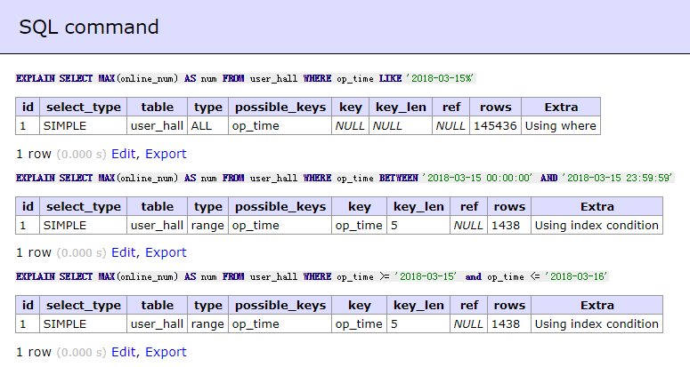

# 关于一个mysql查询索引的对比

## 表结构

| 字段 | 类型 |
| ---- | ---- |
| id | int(10) |
| online_num | int(10) |
| op_time | datetime |

## 索引

| PRIMARY | id |
| ---- | ---- |
| INDEX | op_time |


## 对比

```sql
EXPLAIN SELECT MAX(online_num) AS num FROM user_hall WHERE op_time LIKE '2018-03-15%';
EXPLAIN SELECT MAX(online_num) AS num FROM user_hall WHERE op_time BETWEEN '2018-03-15 00:00:00' AND '2018-03-15 23:59:59';
EXPLAIN SELECT MAX(online_num) AS num FROM user_hall WHERE op_time >= '2018-03-15' AND op_time <= '2018-03-16';

```



