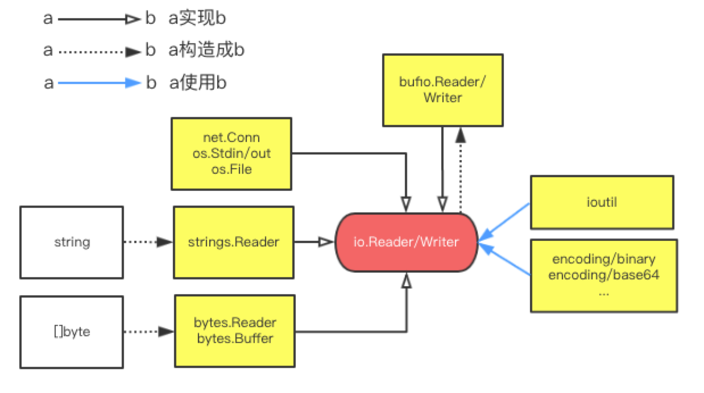

# io.Writer相关

## 接口图

围绕`io.Reader/Writer`，有几个常用的实现：

 - net.Conn, os.Stdin, os.File: 网络、标准输入输出、文件的流读取
 - strings.Reader: 把字符串抽象成Reader
 - bytes.Reader: 把[]byte抽象成Reader
 - bytes.Buffer: 把[]byte抽象成Reader和Writer
 - bufio.Reader/Writer: 抽象成带缓冲的流读取（比如按行读写）

