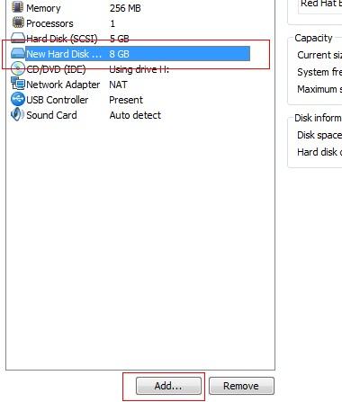
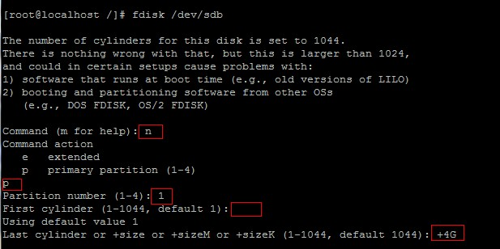

# Linux磁盘管理

如何在Linux增加一块磁盘？
真机的话，就直接插进去一块硬盘
VMware下的话，编辑虚拟机，增加一块硬盘，如下图：



增加成功后，在`/dev/`就会显示出来，如`/dev/sdb`
```
[root@localhost /]# ls /dev/sd*
/dev/sda  /dev/sda1  /dev/sda2  /dev/sdb
```


## 查看系统的磁盘情况
```
[root@localhost /]# fdisk -l

Disk /dev/sda: 5368 MB, 5368709120 bytes
255 heads, 63 sectors/track, 652 cylinders
Units = cylinders of 16065 * 512 = 8225280 bytes

   Device Boot      Start         End      Blocks   Id  System
/dev/sda1   *           1          13      104391   83  Linux
/dev/sda2              14         652     5132767+  8e  Linux LVM

Disk /dev/sdb: 8589 MB, 8589934592 bytes
255 heads, 63 sectors/track, 1044 cylinders
Units = cylinders of 16065 * 512 = 8225280 bytes

Disk /dev/sdb doesn't contain a valid partition table
```

_PS:上面有一个提示，说sdb没有分区表_

## 给新磁盘分区
因为操作步骤太多，如下图：



标红为输入信息，空的话，为回车，采用默认设置
_PS：一块磁盘最多为4个主分区，一个扩展分区最多为15个逻辑分区_
分完区后，输入w, 意思为写入分区表


## 格式化分区
格式化之前，需要生成设备文件，用命令`partprobe`

```
[root@localhost /]# ls /dev/sdb*
/dev/sdb  /dev/sdb1  /dev/sdb2

#格式化为ext3
[root@localhost /]# mkfs.ext3 /dev/sdb1

#格式化为交换空间类型
[root@localhost /]# mkswap /dev/sdb2
```

## 挂载分区
```
#挂载ext3类型分区，挂载成功，说明磁盘已经正常使用
[root@localhost /]# mount /dev/sdb1 /mnt

#挂载交换空间
[root@localhost /]# swapon /dev/sdb2
```