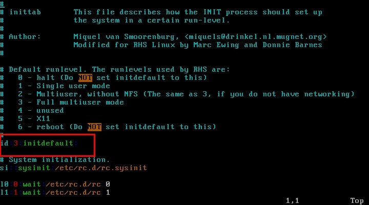

# Linux运行模式

linux有六种运行级别，其中5为图形模式，3为字符模式。启动模式记录在inittab文件中，此文件在etc目录中。
标准的Linux运行级为3或者5，如果是3的话，系统就在多用户状态。如果是5的话，则是运行着X Window 系统。如果目前正在3或5，而你把运行级降低到2的话，init就会执行K45named脚本。
不同的运行级定义如下：(可以参考Red Hat Linux里面的/etc/inittab）
```
# 缺省的运行级，RHS用到的级别如下：
# 0 - 停机（千万不要把initdefault设置为0 ）
# 1 - 单用户模式
# 2 - 多用户，但是没有NFS
# 3 - 完全多用户模式
# 4 - 没有用到
# 5 - X11
# 6 - 重新启动（千万不要把initdefault设置为6 ）
```

假如你之前文本模式安装的话，就算装了图形界面
但默认进去的还是字符界面，这个时候你修改 `/etc/ininttab` 文件

`id:3:initdefault:`

改成：

`id:5:initdefault:`

如下图：




然后重启就可以了

