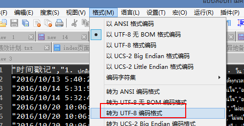

# utf8编码的csv文件用wps,excel打开乱码解决方法

今天在google forms导出一份csv文件，里面内容有泰文，中文
发现直接用WPS或Excel打开，直接出现乱码，用文件编辑器（notepadd++）打开正常显示

网上搜索了一下，有些人建议，把文件转成ansi码再打开，但这样文件本身的编码全乱了。

后来猜想，是不是Excel可能没有认为打开的文件是UTF8编码的，那一般软件去测试文件，
都是以为BOM来检测，后来用Notepad++ 【格式】->【转为UTF-8编码格式】再保存。

果然就正常了。